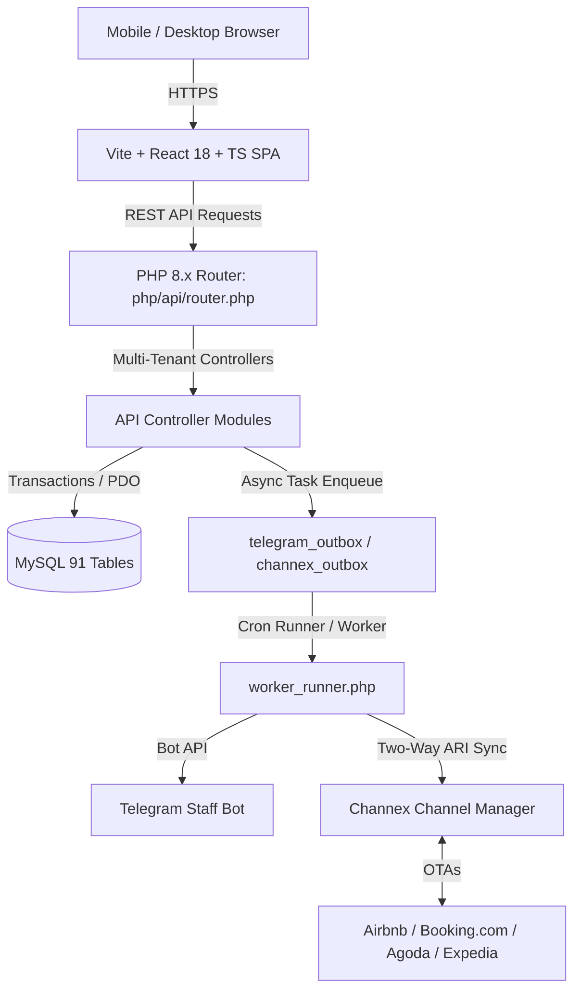

# GroundCode (Artists Farm) — Master System Blueprint & Architecture Bible

> **Single Source of Truth** for Developers, Product Designers, and AI Agents.
> Last Updated: September 2026

---

## 1. Executive Summary & Brand Identity

### 1.1 Product Identity
**GroundCode** is a high-velocity, cloud-native **Hospitality & Resort Management SaaS (PMS, POS, KDS, Channel Manager & Guest Engine)** engineered specifically for boutique resorts, luxury villas, homestays, bed & breakfasts, and independent hotels.

### 1.2 GroundCode Brand Manifesto (Core Principles)
- **<= 10 Words Per Line**: All marketing, value props, and customer-facing lines must be strictly $\le$ 10 words.
- **Maximum Visuals & Icons**: Prioritize icon tiles, data badges, and workflow diagrams over dense text.
- **Friendly Homestay Host Tone**: Speak directly like a warm, supportive hospitality partner. No corporate lectures.
- **Zero Fake URLs**: Never display dummy placeholder domains like `domain.com/path` in screenshots or cards.
- **100% Mobile Phone Optimized**: Never mention tablets. Operators manage their property entirely from smartphones.
- **Telegram Strictly for Staff**: Caretakers, cleaners, guards, and cooks receive instant job cards with zero app installs.
- **WhatsApp Strictly for Guests**: Direct booking confirmations, digital check-in passes, and checkout folios.
- **Honest Product Scope**: GroundCode contains a complete hotel PMS suite, deliberately rolled out to small properties first for rock-solid stability.

---

## 2. Technology Stack & Technical Architecture

### 2.1 Frontend Architecture
- **Framework**: React 18 with TypeScript (strict typing mode).
- **Styling**: Tailwind CSS v3 with custom tokens in `tailwind.config.js` and `DESIGN.md`.
- **Component Library**: Custom Flowbite-standard component system (`src/components/`).
- **Icons**: Lucide React (`lucide-react`) exclusively.
- **State Management**:
  - `AuthContext.tsx`: Session token, active user, system role, financial handler status.
  - `PropertyContext.tsx`: Active property selection, multi-property tenancy, property switchers.
  - `NotificationContext.tsx`: Real-time operational alerts, KDS order pings, housekeeping tasks.
  - `ToastContext.tsx`: Standardized Flowbite toast notifications.
- **Routing**: Multi-tenant hash & search parameter based routing (`?property_id=...`), preserving instant page reloads without deep URL collisions on standard Apache webhosts.

### 2.2 Backend Architecture
- **Language**: PHP 8.x structured procedural / modular service architecture.
- **Central Gateway**: `php/api/router.php` (central dispatcher with authentication and RBAC guards).
- **Core Modules**:
  - `php/guests/`: Booking engine, room allocation, guest folios, ID proofs.
  - `php/billing/`: Folios, GST invoices, cash drawer, settlements, expense vouchers.
  - `php/kitchen/`: Food menu, categories, recipe costs, KDS tickets.
  - `php/inventory/`: Stock tracking, purchase orders, requisitions, low-stock alerts.
  - `php/staff/`: Shift attendance, payroll, leave management, staff directory.
  - `php/services/`: Housekeeping, maintenance dispatch, room readiness statuses.
  - `php/channex/`: OTA ARI updates, inbound webhooks, room type rate mapping.
  - `php/telegram/`: Staff bot outbox dispatch, command listeners, check-in pings.
- **Outbox Architecture**: Non-blocking database queue (`worker_runner.php`, `telegram_outbox`, `channel_manager_outbox`) ensures frontend user operations never stall on third-party API latency.

### 2.3 Database Architecture
- **Engine**: MySQL 8.x / MariaDB, InnoDB engine, `utf8mb4_unicode_ci`.
- **91 Relational Tables**: Full schema isolating properties, rooms, folios, KDS tickets, and audit trails.
- **Multi-Tenant Scoping**: Strict multi-tenant isolation via `tenant_id` and `property_id` in every SQL query.

---

## 3. RBAC & User Role Permissions

| Role Name | Scope | Operational Responsibilities |
| :--- | :--- | :--- |
| **`root_admin`** | Platform Master | Tenant account provisioning, license management, platform audit. |
| **`super_admin`** | Tenant Owner | Multi-property management, financial oversight, company settings. |
| **`admin`** | Property Manager | Full property control, rates, inventory, staff, and folios. |
| **`staff_supervisor`** | Front Desk Lead | Guest check-ins/outs, room moves, service dispatch, cashier. |
| **`staff_kitchen`** | Kitchen / Chef | KDS order management, recipe review, menu availability. |
| **`staff`** | Field Staff | Housekeeping status updates, attendance, assigned jobs. |
| **`financial_handler`** | Permission Flag | Authorization to view cash registers, settle folios, and print GST. |

---

## 4. Complete Feature Inventory

### 4.1 Visual Reservation Grid & Front Desk
- **Multi-Room Calendar**: Drag-to-book, lane-based timeline view across all property rooms.
- **OTA Source Tagging**: Instant visual distinction between Direct, Airbnb, Booking.com, Agoda, and Phone bookings.
- **Guest Folio Engine**: Consolidated billing tracking room rent, restaurant KDS orders, laundry, extra beds, and advance payments.
- **GST Invoice Generator**: Compliant Indian GST calculation (CGST + SGST or IGST) with HSN/SAC codes and printable PDF invoices.
- **Digital Guest Check-In Pass**: QR-based guest self check-in link with ID document uploads.

### 4.2 KDS (Kitchen Display System) & Restaurant POS
- **Live Ticket Board**: Real-time order cards transitioning from New $\rightarrow$ Preparing $\rightarrow$ Ready $\rightarrow$ Served.
- **Digital Menu & Out-of-Stock Toggles**: One-tap toggle for 86'd items.
- **Recipe Costing & Profit Margins**: Automated margin calculation linking food menu items to raw inventory consumption.

### 4.3 Inventory & Cash Drawer
- **Stock Requisition Flow**: Departmental requests with manager approval gates.
- **Low-Stock Alerts**: Automatic warnings when inventory drops below safety thresholds.
- **Petty Cash Register**: Opening float, cash-in/cash-out tracking, end-of-shift reconciliation.

### 4.4 Channel Manager (Channex Integration)
- **Two-Way Live Sync**: Automatic rate, availability, and restriction push to all connected OTAs.
- **Inbound Booking Webhooks**: OTA reservations automatically create bookings, allocate rooms, and update inventory.
- **Rate Multipliers**: Markup rules per channel to offset OTA commission fees.

### 4.5 Telegram Staff Bot (Zero App Installation)
- **Automated Job Alerts**: Caretakers receive instant Telegram pings for new arrivals and cleanings.
- **One-Tap Completion**: Staff reply or tap inline buttons to mark rooms as clean or maintenance as complete.

---

## 5. Strict UI/UX Standards & Design Rules

All components must strictly adhere to `DESIGN.md` and `.agents/AGENTS.md`:

1. **Popovers Only (No Generic Tooltips)**:
   - Never use browser native `title="..."` attributes or generic `<Tooltip>` wrappers.
   - Always use Flowbite `<Popover>` (`src/components/Popover.tsx`) with dark mode support.
2. **Buttons Everywhere (No Plain Action Links)**:
   - All interactive actions must be formal Flowbite `<Button>` components (`src/components/Button.tsx`).
   - Never use colored anchor links or plain clickable spans for functional operations.
3. **Strict No Capsule / No Pill Buttons**:
   - Action buttons must **never** be `rounded-full` or capsule-shaped.
   - Standard geometry is strictly `rounded-lg` with `h-8` (`size="sm"`) or `h-10` (`size="md"`).
   - `rounded-full` is exclusively reserved for non-interactive status chips and count badges.
4. **Bordered Count Badges**:
   - Every count pill and badge must have a matching border token (`border border-blue-200 dark:border-blue-800`, etc.) in both light and dark modes.
5. **Non-Interactive Badges**:
   - `<Badge>` components are strictly passive. If an element triggers an action or navigates, it must be a `<Button>`.
6. **Action Hierarchy & Secondary Edit**:
   - Primary: 1 per card/modal (`variant="primary"`).
   - Secondary: Filter/cancel (`variant="secondary"`).
   - Secondary Edit: Reserved for edit actions (`variant="edit"` bg-blue-50 text-blue-700).
   - Destructive: Always red styling tokens (`Trash2` trashcan icon; never swap to `X` on mobile).
7. **Category Filter Toggle**:
   - Category filter pills must be collapsed by default, toggled via a `<Filter className="w-4 h-4" />` button beside the search input.
8. **Unified Spinner**:
   - Always use `<Loader2 className="animate-spin" />` for all loading states. Custom CSS spinner rings are prohibited.
9. **Typography Discipline**:
   - Maximum 3 font sizes on any screen (`text-lg/text-base`, `text-xs`, `text-2xs`).
   - Standard font family: `Inter, sans-serif`.

---

## 6. Environments & Deployment Policies

### 6.1 Environments
- **Local Development**: `c:\xampp\htdocs\artists_farm` (Apache + MySQL via XAMPP).
- **Staging Server**: `https://staging.ground-code.com`
  - Automated deployment via `deploy-staging.ps1`.
  - Deployment policy: Requires running local checks (`tsc`, `npm run build`, `php -l`) and presenting a full ask block to the user.
  - Requires explicit user approval for every single deploy.
- **Production Server**: `https://ground-code.com`
  - Governed by **HARD BLOCK** rule in `CLAUDE.md`. Never run production scripts without explicit written confirmation.

---

## 7. Strategic Product Roadmap

1. **GroundCode Pro Subscription Engine**:
   - Base plan: ₹1,499/month + ₹200/room add-on.
   - Integrated offline & UPI invoice billing for property owners.
2. **Automated WhatsApp Guest Communication**:
   - WhatsApp Cloud API integration for check-in voucher delivery, WiFi credentials, and checkout invoice PDFs.
3. **Multi-Property Group Analytics**:
   - Consolidated portfolio performance dashboard for hotel chains and villa management agencies.
