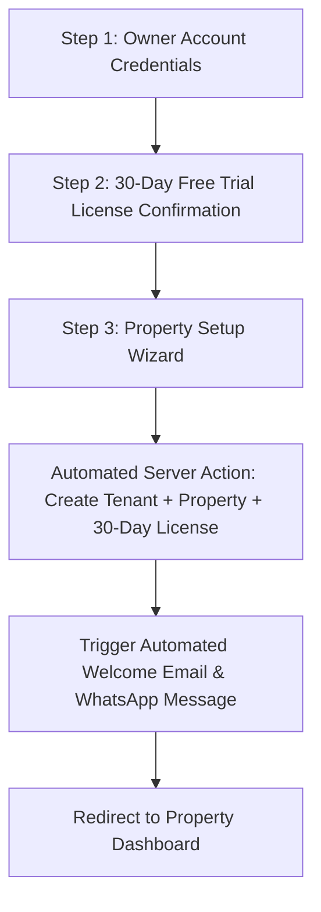
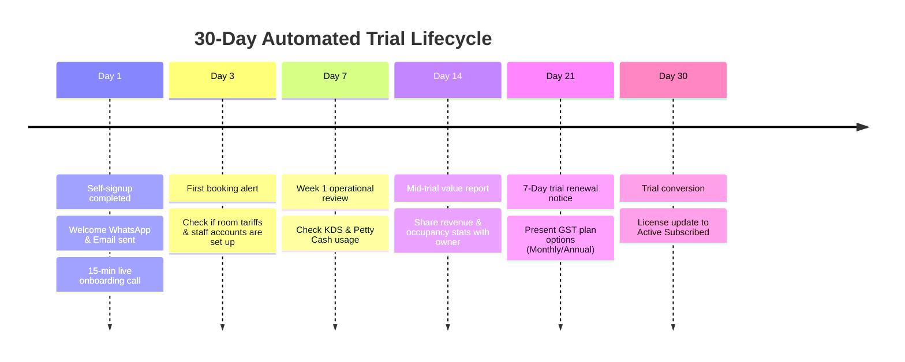

# 🚀 Client Onboarding & Automated 30-Day Trial Strategy (`onboarding.md`)

This document defines the complete end-to-end strategy for client acquisition, interactive demo onboarding, self-service automated signup, WhatsApp/Email notification templates, and the 30-day trial follow-up lifecycle.

---

## 1. 📱 WhatsApp Introductory Pitch Message

Send this introductory message over WhatsApp to prospective hotel/resort owners to drive them to your landing page and live interactive demo:

```text
Namaste [Owner Name] ji! 🙏

Are you still managing room bookings, guest bills, and kitchen orders on paper registers or outdated software?

Discover *Ground Code PMS & KDS* — the modern, mobile-first resort management platform built specifically for Indian hotels, resorts, and homestays.

✨ **Key Features:**
• 📅 Multi-Room Interactive Booking Grid
• 🔑 Fast Check-in & Guest ID Document Uploads
• 🛂 Foreign National C-Form Filing with Barcode Auto-Scan
• 📲 1-Click WhatsApp Booking Confirmations & GST Invoices with UPI QR
• 🔄 2-Way OTA Calendar Sync (Airbnb, Booking.com, Agoda, MakeMyTrip)
• 🍳 Integrated Kitchen Display System (KDS) & Restaurant Billing
• 💰 Petty Cash Drawer & Daily Expense Tracking
• 👥 Staff Attendance, Wage Logs & Role-Based Permissions
• 📊 Real-Time Revenue Analytics & Police/GST Registers

🎁 **Exclusive Offer**: Get 30 Days Full Access Absolutely FREE (No Credit Card Required).

Try our live interactive demo here:
👉 https://yourdomain.com/demo

Or set up your property in 2 minutes:
👉 https://yourdomain.com/onboarding

Need a quick call? Reply "YES" and we'll arrange a 10-minute walk-through.

Warm regards,
[Your Name / Agency Name]
Ground Code SaaS Team
📞 [Your Contact Number]
```

---

## 2. 🎯 Demo Site Interactive Onboarding Tour (Comprehensive Step Sequence)

> [!NOTE]
> You can edit this table to change the order, descriptions, titles, or active targets of the onboarding tour. Once updated, the interactive tour engine ([`DemoOnboardingTour.tsx`](file:///c:/xampp/htdocs/artists_farm/src/components/DemoOnboardingTour.tsx)) will be aligned accordingly.

### 📋 Complete Interactive App Tour Steps Table

| Step # | Category | Step ID | Title | Description | Selector (`data-tour`) | Target Screen / Tab | Action / Hook |
| :---: | :--- | :--- | :--- | :--- | :--- | :--- | :--- |
| **1** | 🏨 **Front Desk & Daily Operations** | `booking-grid` | 📅 Multi-Room Calendar & Daily Operations Overview | Track real-time room availability, daily tariffs, active kitchen orders, pending guest requests, and manage folios right from one unified calendar — getting 50% of your daily operations done instantly. | `[data-tour="booking-grid"]` | `#dashboard` (Multi-Room Calendar) | `handleNavigateTab('dashboard', 'dashboard')` |
| **2** | 🏨 **Front Desk & Daily Operations** | `checkin-folio` | 🔑 Fast Check-In, ID Upload & C-Form Barcode Scan | Effortlessly upload guest Aadhaar/Passport IDs, record advance payments, and upload foreign C-Form PDFs where the Applicant ID is automatically detected via barcode scan and saved to booking records in seconds. | `[data-tour="checkin-folio"]` | `BookingDetailsModal` (Drawer & C-Form Container) | `openCFormSection` (sticks in modal, auto-expands C-Form section) |
| **3** | 🏨 **Front Desk & Daily Operations** | `whatsapp-invoicing` | 📲 1-Click Share & Real-Time WhatsApp Message Preview | Click Share to review the exact formatted booking confirmation and GST bill before sending — complete with guest details, check-in dates, maps link, and scannable UPI QR payment code. | `[data-tour="share-preview-drawer"]` | `BookingDetailsModal` (Share Preview Drawer) | `openSharePreview` (clicks Share button to open preview drawer) |
| **4** | 🏨 **Front Desk & Daily Operations** | `bookings-manager` | 📋 Past, Present & Future Bookings Manager | Search and filter across all historical stays, currently checked-in guests, and upcoming future reservations with real-time balance tracking, folios, and instant check-out workflows. | `[data-tour="bookings-manager"]` | `#guests/all_bookings` (All Bookings Desk) | `handleNavigateTab('guests', 'all_bookings')` |
| **5** | 🏨 **Front Desk & Daily Operations** | `service-requests-board` | 🛎️ Service Requests & 1-Tap Telegram Fulfillment | Log guest housekeeping and room service requests in seconds. Staff get instant Telegram push notifications and can fulfill or update tasks with 1 tap directly from Telegram without needing to open the app. | `[data-tour="service-requests-board"]` | `#service_requests` (Service Requests Board) | `handleNavigateTab('service_requests', 'service_requests')` |
| **6** | 🏨 **Front Desk & Daily Operations** | `ota-sync` | 🔄 2-Way OTA Calendar Sync (iCal) | Sync bookings automatically with Airbnb, Booking.com, Agoda, and MakeMyTrip to prevent double-bookings across channels. | `[data-tour="ota-sync"]` | `#room-slug/edit_property` (Room Edit Tab) | `onNavigateToRoom(roomSlug, 'edit_property')` |
| **7** | 🏨 **Front Desk & Daily Operations** | `mobile-bottom-nav` | 📱 Quick Actions & Mobile Navigation | Quickly access 1-tap booking creation, instant expense logging, food ordering, and seamless navigation across all resort management screens. | `[data-tour="mobile-bottom-nav"]` | Mobile / Desktop Navigation Shell | `goToFirstRoomDashboard` |
| **8** | 🍳 **Kitchen Display & Dining** | `kds-kitchen` | 🍳 Live Kitchen Display System (KDS) | Streamline food prep timers, live kitchen order tickets, and room service delivery status on kitchen display screens. | `[data-tour="kds-kitchen"]` | `#room-slug/dashboard` (Live KDS Orders) | `goToFirstRoomDashboard` |
| **9** | 📦 **Inventory & Stock Requisitions** | `inventory-stock` | 📦 Raw Material Stock Tracker | Track kitchen grocery stock, linen inventory, and cleaning supplies with live quantities and automated low-stock reorder threshold alerts. | `[data-tour="inventory-stock"]` | `#inventory/stock_log` (Live Stock Log & Inventory Tracker) | `handleNavigateTab('inventory', 'stock_log')` |
| **10** | 📦 **Inventory & Stock Requisitions** | `stock-requisition` | 📋 Material Requisitions | Allow kitchen staff to request raw ingredients from store managers directly from the Request Materials catalog with complete approval and audit workflows. | `[data-tour="stock-requisition"]` | `#inventory/stock_requests` (Request Materials Tab) | `handleNavigateTab('inventory', 'stock_requests')` |
| **11** | 💰 **Petty Cash & Expense Control** | `petty-cash` | 💰 Petty Cash & Vendor Expenses | Log daily vendor payouts, staff cash drawer shift openings/closings, and cash drawer reconciliations with zero discrepancy. | `[data-tour="petty-cash"]` | `#petty_cash/expenses` | `handleNavigateTab('petty_cash', 'expenses')` |
| **12** | 💰 **Petty Cash & Expense Control** | `cash-drawer` | 💵 Shift Cash Drawer Balance | Reconcile cash collected at front desk shift changes with automated tallying of cash, UPI, card, and bank transfers. | `[data-tour="cash-drawer"]` | `#petty_cash/finances` | `handleNavigateTab('petty_cash', 'finances')` |
| **13** | 👥 **Staff, Attendance & Salary** | `staff-permissions` | 👥 Multi-Role Staff RBAC Permissions | Assign granular access roles (Front Desk, Kitchen Staff, Supervisor, Accountant) to control sensitive financial visibility. | `[data-tour="staff-permissions"]` | `#staff/staff_permissions` | `handleNavigateTab('staff', 'staff_permissions')` |
| **14** | 👥 **Staff, Attendance & Salary** | `create-team-member` | ➕ Add New Staff & Team Accounts | Create and configure new staff member profiles, assign roles, set daily wages or monthly salaries, and manage operational permissions. | `[data-tour="create-team-member"]` | `#staff/staff_permissions` | `handleNavigateTab('staff', 'staff_permissions')` |
| **15** | 👥 **Staff, Attendance & Salary** | `attendance-salary` | 📅 Attendance Calendar & Monthly Salaries | Track daily staff present/absent logs, advance salary payouts, and generate automated monthly salary slips. | `[data-tour="attendance-salary"]` | `#staff/attendance_calendar` | `handleNavigateTab('staff', 'attendance_calendar')` |
| **16** | 🤖 **Real-Time Operations Alerts** | `telegram-alerts` | 🤖 Real-Time Telegram Push Alerts | Get instant push alerts on your phone whenever a guest checks in, a kitchen order is placed, or cash is paid out. | `[data-tour="telegram-alerts"]` | `#telegram/telegram` | `handleNavigateTab('telegram', 'telegram')` |
| **17** | 📊 **Analytics & Business Intel** | `analytics-summary` | 📊 Revenue, ADR & Occupancy Analytics | Analyze daily occupancy rates, Average Daily Rate (ADR), and Profit per Room Night metrics. | `[data-tour="analytics-summary"]` | `#analytics/dashboard_analytics` | `handleNavigateTab('analytics', 'dashboard_analytics')` |
| **18** | 📖 **Food Menu & Recipe Builder** | `recipe-builder` | 📖 Recipe Builder & Food Menu Manager | Manage food item pricing, categories, ingredients cost breakdown, and staff meal logs effortlessly. | `[data-tour="recipe-builder"]` | `#kitchen/beta_recipe_builder` | `handleNavigateTab('kitchen', 'beta_recipe_builder')` |

---

## 3. 🤖 Automated 3-Step Self-Service Onboarding Funnel

Once a prospect decides to try the platform, they click **"Start 30-Day Free Trial"** and complete an automated 3-step setup wizard:



### Step 1: Owner Account Credentials
- **Full Name**: e.g., *Rajesh Sharma*
- **Email Address**: *Owner email for invoices & receipts*
- **Mobile Number (Username)**: *10-digit mobile number (used as login username)*
- **Passcode**: *6-digit PIN code*

### Step 2: 30-Day Free Trial License Summary
- **License Type**: `Trial`
- **Start Date**: Current Date
- **Expiry Date**: Today + 30 Days
- **Fee**: `₹0` (No Credit Card / Prepayment Required)
- **Status**: `Active` (Auto-alerts set for 7 days prior to expiry)

### Step 3: Property Setup Wizard
- **Property Name**: e.g., *Vrikshawan Resort Hut*
- **Property Type**: `Single Property` (Whole villa/hut) OR `Multi-Room Resort`
- **Room Count**: Total number of rooms
- **Default Check-in / Check-out Times**: `14:00` / `11:00`
- **Kitchen Toggle**: Has kitchen? (`Yes` / `No`)

### Step 4: Add Dashboard as a Mobile App (PWA)
- **iPhone (iOS Safari)**: Tap **Share** -> Scroll down & tap **Add to Home Screen** -> Tap **Add**.
- **Android (Chrome)**: Tap **3-Dots Menu** -> Tap **Install App** / **Add to Home Screen** -> Tap **Install**.

---

## 4. 📩 Automated Welcome Email & WhatsApp Messages

Upon completing Step 3 of the onboarding wizard, the system automatically triggers both a WhatsApp notification (via WhatsApp Business API) and an HTML Welcome Email (via `mailer.php`).

### 📱 Automated WhatsApp Welcome Message

```text
🎉 Welcome to Ground Code, [Owner Name] ji!

Your 30-Day Free Trial for *[Property Name]* is now LIVE!

🔐 **Your Login Credentials:**
• Dashboard URL: https://yourdomain.com/[property_slug]
• Username (Mobile): [Owner Mobile Number]
• Passcode: [6-Digit Passcode]
• Trial Expiry Date: [Current Date + 30 Days]

📱 **IMPORTANT NEXT STEP: Add Dashboard to your Phone Home Screen**
1️⃣ Open the link: https://yourdomain.com/[property_slug]
2️⃣ On iPhone: Tap 'Share' -> 'Add to Home Screen'
3️⃣ On Android: Tap '3 Dots' -> 'Install App' / 'Add to Home Screen'

🚀 **Quick Action Steps:**
1️⃣ Open your property app on your phone
2️⃣ Click "Check-in Guest" to post your first booking
3️⃣ Tap "Share WhatsApp Bill" to test guest invoices

Need help? Reply to this message anytime to connect with your dedicated account manager.

Happy Managing!
The Ground Code Team
```

### 📧 Automated HTML Welcome Email Template

```html
<!DOCTYPE html>
<html>
<head>
  <style>
    body { font-family: 'Inter', sans-serif; background-color: #f8fafc; color: #1e293b; margin: 0; padding: 20px; }
    .container { max-width: 600px; margin: 0 auto; background: #ffffff; border-radius: 12px; border: 1px solid #e2e8f0; padding: 32px; }
    .header { text-align: center; border-bottom: 1px solid #f1f5f9; padding-bottom: 20px; }
    .brand { color: #2563eb; font-size: 24px; font-weight: bold; }
    .cred-box { background-color: #f1f5f9; border-radius: 8px; padding: 16px; margin: 20px 0; border-left: 4px solid #2563eb; }
    .button { display: inline-block; background-color: #2563eb; color: #ffffff; text-decoration: none; padding: 12px 24px; border-radius: 8px; font-weight: 600; margin-top: 16px; }
    .footer { font-size: 12px; color: #64748b; margin-top: 30px; text-align: center; }
  </style>
</head>
<body>
  <div class="container">
    <div class="header">
      <div class="brand">Ground Code SaaS</div>
      <h2>Welcome to Your 30-Day Free Trial!</h2>
    </div>

    <p>Dear <strong>[Owner Name]</strong>,</p>
    <p>Thank you for choosing Ground Code for <strong>[Property Name]</strong>. Your account has been provisioned and is ready for immediate use.</p>

    <div class="cred-box">
      <p style="margin:0 0 8px 0;"><strong>Login Details:</strong></p>
      <p style="margin:4px 0;">🌐 <strong>Dashboard URL:</strong> <a href="https://yourdomain.com/[property_slug]">https://yourdomain.com/[property_slug]</a></p>
      <p style="margin:4px 0;">📱 <strong>Username:</strong> [Owner Mobile Number]</p>
      <p style="margin:4px 0;">🔑 <strong>Passcode:</strong> [6-Digit PIN]</p>
      <p style="margin:4px 0;">📅 <strong>Trial Expiration:</strong> [Current Date + 30 Days]</p>
    </div>

    <center>
      <a href="https://yourdomain.com/[property_slug]" class="button">Access Your Dashboard Now</a>
    </center>

    <p style="margin-top: 24px;">During your 30-day trial, you have full access to all features including room bookings, WhatsApp billing, KDS kitchen display, and financial logs with zero restriction.</p>

    <div class="footer">
      Ground Code Resort & Hotel Management SaaS • Support: +91-XXXXXXXXXX
    </div>
  </div>
</body>
</html>
```

---

## 5. 🗓️ 30-Day Trial Lifecycle & Follow-up Cadence


