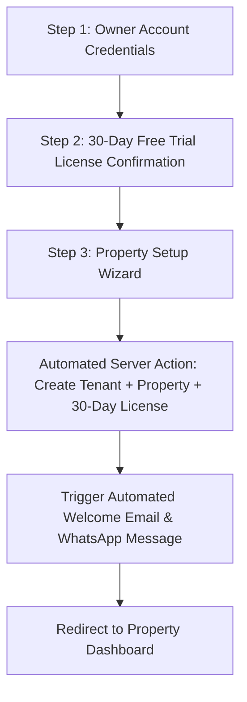
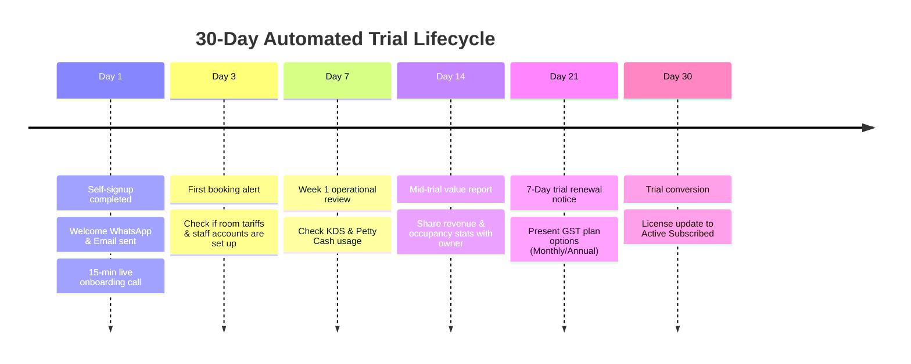

# 🚀 Client Onboarding & Automated 30-Day Trial Strategy (`onboarding.md`)

This document defines the complete end-to-end strategy for client acquisition, interactive demo onboarding, self-service automated signup, WhatsApp/Email notification templates, and the 30-day trial follow-up lifecycle.

---

## 1. 📱 WhatsApp Introductory Pitch Message

Send this introductory message over WhatsApp to prospective hotel/resort owners to drive them to your landing page and live interactive demo:

```text
Namaste [Owner Name] ji! 🙏

Are you still managing room bookings, guest bills, and kitchen orders on paper registers or outdated software?

Discover *Ground Code PMS & KDS* — the modern, mobile-first resort management platform built specifically for Indian hotels, resorts, and homestays.

✨ **Key Features:**
• 📅 Multi-Room Interactive Booking Grid
• 📲 1-Click WhatsApp Booking Confirmations & GST Invoices
• 🍳 Integrated Kitchen Display System (KDS) & Restaurant Billing
• 💰 Petty Cash Drawer & Daily Expense Tracking
• 📊 Real-Time Revenue Analytics & Staff Permissions

🎁 **Exclusive Offer**: Get 30 Days Full Access Absolutely FREE (No Credit Card Required).

Try our live interactive demo here:
👉 https://yourdomain.com/demo

Or set up your property in 2 minutes:
👉 https://yourdomain.com/onboarding

Need a quick call? Reply "YES" and we'll arrange a 10-minute walk-through.

Warm regards,
[Your Name / Agency Name]
Ground Code SaaS Team
📞 [Your Contact Number]
```

---

## 2. 🎯 Demo Site Interactive Onboarding Tour (8 Category-Based Popovers)

### Architecture
An interactive modular popover tour engine built using standard Flowbite popovers ([`Popover.tsx`](file:///c:/xampp/htdocs/artists_farm/src/components/Popover.tsx)) and target element selectors (`data-tour="target-id"`). Visitors can navigate sequentially or switch between feature category pills at any time:

```
+-----------------------------------------------------------------------------------------+
|                                                                                         |
|   +---------------------------------------------------------------------------------+   |
|   |  Popover Tour Card (z-index: 9999)                                              |   |
|   |  [Core PMS] [Automation] [Food & Beverage] [Store Ops] [Financials] [HR & Team] |   |
|   |  -----------------------------------------------------------------------------  |   |
|   |  Step 1 of 3: 📅 Interactive Multi-Room Booking Grid                            |   |
|   |  Track real-time room availability, check-ins, check-outs, and guest folios.    |   |
|   |                                                                                 |   |
|   |  [Skip Tour]                                         [< Previous]  [Next Step >]  |   |
|   +---------------------------------------------------------------------------------+   |
|                                                                                         |
+-----------------------------------------------------------------------------------------+
```

### Complete 8-Module App Feature Tour Coverage

| Module / Category | Tour Element Target | Popover Step Title | Feature Coverage & Description |
| :--- | :--- | :--- | :--- |
| 🏨 **1. Front Desk & Reservations** | `[data-tour="booking-grid"]`<br>`[data-tour="checkin-folio"]`<br>`[data-tour="ota-sync"]` | • Interactive Booking Grid<br>• Fast Check-in & Guest ID Upload<br>• 2-Way OTA Calendar Sync (iCal) | Real-time calendar grid, room tariffs, guest folios, Aadhaar/Passport ID uploads, foreign C-Form filing, and 2-way sync with Airbnb/Booking.com/Agoda. |
| 📲 **2. WhatsApp Bills & UPI QR** | `[data-tour="whatsapp-invoicing"]`<br>`[data-tour="whatsapp-templates"]` | • 1-Click WhatsApp Invoices<br>• Custom WhatsApp Message Templates | Instant booking vouchers and tax bills sent via WhatsApp API with scannable UPI QR codes and customizable templates. |
| 🍳 **3. Kitchen Display (KDS)** | `[data-tour="kds-kitchen"]`<br>`[data-tour="recipe-builder"]` | • Live Kitchen Display (KDS)<br>• Recipe Builder & Menu Manager | Food order prep timers, room service delivery tickets, dish recipe ingredient costing, and staff meal logging. |
| 📦 **4. Inventory & Requisitions** | `[data-tour="inventory-stock"]`<br>`[data-tour="stock-requisition"]` | • Raw Material Stock Tracker<br>• Material Requisition Workflow | Grocery & linen stock tracking, low-stock reorder alerts, and kitchen-to-store material requisition approvals. |
| 💰 **5. Petty Cash & Financials** | `[data-tour="petty-cash"]`<br>`[data-tour="cash-drawer"]` | • Petty Cash & Vendor Payouts<br>• Shift Cash Drawer Balance | Vendor expense logs, petty cash vouchers, front-desk shift cash drawer openings/closings, and cash vs. UPI tallying. |
| 👥 **6. Staff, Attendance & HR** | `[data-tour="staff-permissions"]`<br>`[data-tour="attendance-salary"]` | • Multi-Role RBAC Permissions<br>• Attendance & Monthly Salary Slips | Granular access roles (Admin, Supervisor, Kitchen, Front Desk), daily attendance calendar, advance payouts, and salary slips. |
| 🤖 **7. Real-Time Push Alerts** | `[data-tour="telegram-alerts"]` | • Real-Time Telegram Push Alerts | Instant push alerts for check-ins, check-outs, new kitchen orders, cash payouts, and pending material requests. |
| 📊 **8. Analytics, Audit & GST** | `[data-tour="analytics-summary"]`<br>`[data-tour="gst-export"]` | • Revenue, ADR & Occupancy Analytics<br>• 1-Click GST Reports & Police Export | Daily occupancy %, Average Daily Rate (ADR), RevPAR metrics, system audit logs, and 1-click Excel export for GST returns & police registers. |

---

## 3. 🤖 Automated 3-Step Self-Service Onboarding Funnel

Once a prospect decides to try the platform, they click **"Start 30-Day Free Trial"** and complete an automated 3-step setup wizard:



### Step 1: Owner Account Credentials
- **Full Name**: e.g., *Rajesh Sharma*
- **Email Address**: *Owner email for invoices & receipts*
- **Mobile Number (Username)**: *10-digit mobile number (used as login username)*
- **Passcode**: *6-digit PIN code*

### Step 2: 30-Day Free Trial License Summary
- **License Type**: `Trial`
- **Start Date**: Current Date
- **Expiry Date**: Today + 30 Days
- **Fee**: `₹0` (No Credit Card / Prepayment Required)
- **Status**: `Active` (Auto-alerts set for 7 days prior to expiry)

### Step 3: Property Setup Wizard
- **Property Name**: e.g., *Vrikshawan Resort Hut*
- **Property Type**: `Single Property` (Whole villa/hut) OR `Multi-Room Resort`
- **Room Count**: Total number of rooms
- **Default Check-in / Check-out Times**: `14:00` / `11:00`
- **Kitchen Toggle**: Has kitchen? (`Yes` / `No`)

### Step 4: Add Dashboard as a Mobile App (PWA)
- **iPhone (iOS Safari)**: Tap **Share** -> Scroll down & tap **Add to Home Screen** -> Tap **Add**.
- **Android (Chrome)**: Tap **3-Dots Menu** -> Tap **Install App** / **Add to Home Screen** -> Tap **Install**.

---

## 4. 📩 Automated Welcome Email & WhatsApp Messages

Upon completing Step 3 of the onboarding wizard, the system automatically triggers both a WhatsApp notification (via WhatsApp Business API) and an HTML Welcome Email (via `mailer.php`).

### 📱 Automated WhatsApp Welcome Message

```text
🎉 Welcome to Ground Code, [Owner Name] ji!

Your 30-Day Free Trial for *[Property Name]* is now LIVE!

🔐 **Your Login Credentials:**
• Dashboard URL: https://yourdomain.com/[property_slug]
• Username (Mobile): [Owner Mobile Number]
• Passcode: [6-Digit Passcode]
• Trial Expiry Date: [Current Date + 30 Days]

📱 **IMPORTANT NEXT STEP: Add Dashboard to your Phone Home Screen**
1️⃣ Open the link: https://yourdomain.com/[property_slug]
2️⃣ On iPhone: Tap 'Share' -> 'Add to Home Screen'
3️⃣ On Android: Tap '3 Dots' -> 'Install App' / 'Add to Home Screen'

🚀 **Quick Action Steps:**
1️⃣ Open your property app on your phone
2️⃣ Click "Check-in Guest" to post your first booking
3️⃣ Tap "Share WhatsApp Bill" to test guest invoices

Need help? Reply to this message anytime to connect with your dedicated account manager.

Happy Managing!
The Ground Code Team
```

### 📧 Automated HTML Welcome Email Template

```html
<!DOCTYPE html>
<html>
<head>
  <style>
    body { font-family: 'Inter', sans-serif; background-color: #f8fafc; color: #1e293b; margin: 0; padding: 20px; }
    .container { max-width: 600px; margin: 0 auto; background: #ffffff; border-radius: 12px; border: 1px solid #e2e8f0; padding: 32px; }
    .header { text-align: center; border-bottom: 1px solid #f1f5f9; padding-bottom: 20px; }
    .brand { color: #2563eb; font-size: 24px; font-weight: bold; }
    .cred-box { background-color: #f1f5f9; border-radius: 8px; padding: 16px; margin: 20px 0; border-left: 4px solid #2563eb; }
    .button { display: inline-block; background-color: #2563eb; color: #ffffff; text-decoration: none; padding: 12px 24px; border-radius: 8px; font-weight: 600; margin-top: 16px; }
    .footer { font-size: 12px; color: #64748b; margin-top: 30px; text-align: center; }
  </style>
</head>
<body>
  <div class="container">
    <div class="header">
      <div class="brand">Ground Code SaaS</div>
      <h2>Welcome to Your 30-Day Free Trial!</h2>
    </div>

    <p>Dear <strong>[Owner Name]</strong>,</p>
    <p>Thank you for choosing Ground Code for <strong>[Property Name]</strong>. Your account has been provisioned and is ready for immediate use.</p>

    <div class="cred-box">
      <p style="margin:0 0 8px 0;"><strong>Login Details:</strong></p>
      <p style="margin:4px 0;">🌐 <strong>Dashboard URL:</strong> <a href="https://yourdomain.com/[property_slug]">https://yourdomain.com/[property_slug]</a></p>
      <p style="margin:4px 0;">📱 <strong>Username:</strong> [Owner Mobile Number]</p>
      <p style="margin:4px 0;">🔑 <strong>Passcode:</strong> [6-Digit PIN]</p>
      <p style="margin:4px 0;">📅 <strong>Trial Expiration:</strong> [Current Date + 30 Days]</p>
    </div>

    <center>
      <a href="https://yourdomain.com/[property_slug]" class="button">Access Your Dashboard Now</a>
    </center>

    <p style="margin-top: 24px;">During your 30-day trial, you have full access to all features including room bookings, WhatsApp billing, KDS kitchen display, and financial logs with zero restriction.</p>

    <div class="footer">
      Ground Code Resort & Hotel Management SaaS • Support: +91-XXXXXXXXXX
    </div>
  </div>
</body>
</html>
```

---

## 5. 🗓️ 30-Day Trial Lifecycle & Follow-up Cadence


